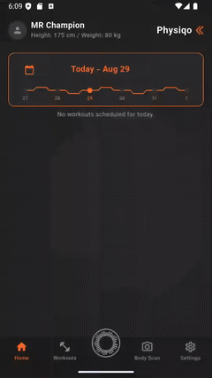
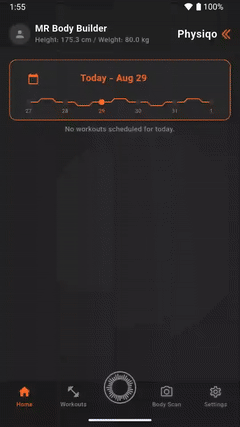

# ⊙ Physiqo — Premium AI-Powered On-Device Fitness & Bodybuilding

<p align="center">
  <b>100% Serverless. Offline-First. Cinematic Dark UI. Full RTL & Multilingual Support.</b>
</p>

<p align="center">
  <a href="#english">English</a> | 
  <a href="#farsi">فارسی</a> | 
  <a href="#chinese">中文</a> | 
  <a href="#hindi">हिन्दी</a> | 
  <a href="#spanish">Español</a> | 
  <a href="#arabic">العربية</a> | 
  <a href="#french">Français</a> | 
  <a href="#bengali">বাংলা</a> | 
  <a href="#portuguese">Português</a> | 
  <a href="#russian">Русский</a> | 
  <a href="#urdu">اردو</a>
</p>

---

<div id="english" dir="ltr">

## 🇺🇸 English

### 📸 Media & Demos
<p align="center">
  
  &nbsp;&nbsp;&nbsp;&nbsp;
  
  <br/>
  <i>Core App Demo (Left) & AI Settings Connection Setup (Right).</i>
</p>

### ⚡ Features
1. **Cinematic Dark Design:** Uses premium hex design tokens (Background `#1C1C1E`, Primary `#FF6B2C`, Surface `#2A2A2C`) with zero neon or shadows for a clean look.
2. **100% Serverless & Private:** AI API keys are stored encrypted locally via `FlutterSecureStorage`.
3. **Multilingual & Auto-RTL:** Instantly switches between 11 languages with correct layout mirroring and alignment.
4. **Body Scan Vision Analysis:** Capture postures and scans to query AI models for alignment and weak points.
5. **Injury Profile Customization:** Dynamically swaps exercises to safeguard joints and muscles from strain.

### 🚀 Quick Start
```bash
flutter pub get
flutter run
```

</div>

---

<div id="farsi" dir="rtl">

## 🇮🇷 فارسی

### 📸 رسانه‌ها و دموها
<p align="center">
  
  &nbsp;&nbsp;&nbsp;&nbsp;
  
  <br/>
  <i>دموی اصلی برنامه (چپ) و نحوه اتصال به هوش مصنوعی در تنظیمات (راست).</i>
</p>

### ⚡ ویژگی‌ها
۱. **طراحی سینمایی تاریک:** استفاده از رنگ‌های تاریک عمیق (پس‌زمینه `#1C1C1E`، نارنجی `#FF6B2C`) بدون افکت نئونی برای حفظ تمرکز و زیبایی.
۲. **۱۰۰٪ بدون سرور مرکزی:** ذخیره امن و رمزنگاری‌شده کلیدهای ارتباطی در حافظه دستگاه به صورت آفلاین.
۳. **پشتیبانی کامل از زبان‌ها و راست‌چین:** هماهنگی فوری چیدمان و جهت متون برای ۱۱ زبان دنیا.
۴. **تحلیل اسکن قامت بدن:** ثبت تصاویر برای ارزیابی وضعیت ستون فقرات و نقاط ضعف عضلانی توسط مربی هوش مصنوعی.
۵. **فیلتر هوشمند آسیب‌دیدگی‌ها:** حذف خودکار حرکات پرخطر و جایگزینی آن‌ها با تمرینات امن متناسب با محدودیت‌های بدنی شما.

### 🚀 راه اندازی سریع
```bash
flutter pub get
flutter run
```

</div>

---

<div id="chinese" dir="ltr">

## 🇨🇳 中文 (Chinese)

### 📸 演示与视频
<p align="center">
  
  &nbsp;&nbsp;&nbsp;&nbsp;
  
  <br/>
  <i>核心应用演示（左）与 AI 设置连接配置指南（右）。</i>
</p>

### ⚡ 核心功能
1. **电影级暗黑设计:** 采用极简高端色彩方案（背景 `#1C1C1E`, 主色 `#FF6B2C`），无过度发光，凸显专业质感。
2. **100% 无服务器与隐私安全:** AI API 密钥均通过 `FlutterSecureStorage` 进行本地加密存储。
3. **多语言与 RTL 镜像:** 一键切换11种语言，排版及阅读方向（左右反转）完美适配。
4. **身体姿态视觉分析:** 录入体态图像，让智能教练评估肩颈脊椎对齐度并指出薄弱肌群。
5. **动态伤病避险:** 自动识别您的关节损伤或痛点，从训练计划中剔除危险动作，替换为更安全的保护性动作。

### 🚀 快速开始
```bash
flutter pub get
flutter run
```

</div>

---

<div id="hindi" dir="ltr">

## 🇮🇳 हिन्दी (Hindi)

### 📸 मीडिया और डेमो
<p align="center">
  
  &nbsp;&nbsp;&nbsp;&nbsp;
  
  <br/>
  <i>कोर ऐप डेमो (बाएं) और एआई सेटिंग्स कनेक्शन सेटअप (दाएं)।</i>
</p>

### ⚡ विशेषताएँ
1. **सिनेमाई डार्क डिज़ाइन:** बिना किसी नियॉन या छाया प्रभाव के प्रीमियम रंगों (बैकग्राउंड `#1C1C1E`, प्राथमिक `#FF6B2C`) का उपयोग।
2. **100% सर्वर रहित और निजी:** एआई एपीआई कुंजियाँ डिवाइस पर स्थानीय रूप से सुरक्षित रूप से एन्क्रिप्ट की जाती हैं।
3. **बहुभाषी और ऑटो-आरटीएल:** सही लेआउट मिररिंग के साथ 11 भाषाओं के बीच त्वरित रूप से परिवर्तन।
4. **बॉडी स्कैन विजन विश्लेषण:** शारीरिक बनावट और मुद्रा संरेखण की जांच के लिए एआई मॉडल का उपयोग।
5. **चोट प्रोफ़ाइल अनुकूलन:** जोड़ों और मांसपेशियों को तनाव से बचाने के लिए सुरक्षित व्यायामों का गतिशील चयन।

### 🚀 त्वरित शुरुआत
```bash
flutter pub get
flutter run
```

</div>

---

<div id="spanish" dir="ltr">

## 🇪🇸 Español (Spanish)

### 📸 Demos y Medios
<p align="center">
  
  &nbsp;&nbsp;&nbsp;&nbsp;
  
  <br/>
  <i>Demo de la App (Izquierda) y Configuración de Conexión de IA (Derecha).</i>
</p>

### ⚡ Características
1. **Diseño Oscuro Cinemático:** Utiliza tokens de diseño premium (Fondo `#1C1C1E`, Primario `#FF6B2C`) sin brillos innecesarios.
2. **100% Local y Privado:** Tus claves API se guardan encriptadas localmente usando `FlutterSecureStorage`.
3. **Multilingüe y RTL:** Se adapta al instante a 11 idiomas con la alineación y dirección de lectura correcta.
4. **Análisis de Postura por Visión:** Escanea y analiza tu postura para detectar desalineaciones y debilidades musculares.
5. **Filtro de Lesiones:** Intercambia automáticamente ejercicios que pongan en riesgo articulaciones con limitaciones físicas.

### 🚀 Inicio Rápido
```bash
flutter pub get
flutter run
```

</div>

---

<div id="arabic" dir="rtl">

## 🇸🇦 العربية (Arabic)

### 📸 الوسائط والعروض
<p align="center">
  
  &nbsp;&nbsp;&nbsp;&nbsp;
  
  <br/>
  <i>عرض التطبيق الأساسي (اليمين) وإعداد اتصال الذكاء الاصطناعي (اليسار).</i>
</p>

### ⚡ الميزات
١. **تصميم داكن سينمائي:** يعتمد على تدرجات داكنة جذابة (الخلفية `#1C1C1E` والبرتقالي النشط `#FF6B2C`) مع التخلي عن التوهج.
٢. **خالٍ من الخوادم تمامًا:** يتم تشفير مفاتيح API محليًا داخل الجهاز لحفظ الخصوصية المطلقة.
٣. **متعدد اللغات ودعم RTL:** يدعم التحول الفوري لـ 11 لغة مع تصحيح اتجاه القراءة وعناصر المحاذاة.
٤. **تحليل الصور ومسح الجسم:** التقاط القوام ليتيح للمدرب الافتراضي فحص اتزان العمود الفقري ونقاط الضعف.
٥. **ملف مخصص للإصابات:** يستبدل الحركات المجهدة للفقرات أو الركب المحددة بتمارين بديلة أكثر أمانًا تلقائيًا.

### 🚀 البدء السريع
```bash
flutter pub get
flutter run
```

</div>

---

<div id="french" dir="ltr">

## 🇫🇷 Français (French)

### 📸 Médias & Démos
<p align="center">
  
  &nbsp;&nbsp;&nbsp;&nbsp;
  
  <br/>
  <i>Démo de l'App (Gauche) & Configuration de la Connexion IA (Droite).</i>
</p>

### ⚡ Fonctionnalités
1. **Design Sombre Cinématique:** Utilise des couleurs premium (Arrière-plan `#1C1C1E`, Primaire `#FF6B2C`, Surface `#2A2A2C`) sans néons ni ombres inutiles.
2. **100% Sans Serveur & Privé:** Vos clés API IA sont chiffrées localement via `FlutterSecureStorage`.
3. **Multilingue & Auto-RTL:** Bascule instantanément entre 11 langues avec le miroir de mise en page correct.
4. **Analyse Posturale Visuelle:** Capturez votre posture pour identifier les désalignements et les points faibles musculaires.
5. **Gestion Dynamique des Blessures:** Adapte automatiquement les entraînements pour éviter les zones blessées.

### 🚀 Démarrage Rapide
```bash
flutter pub get
flutter run
```

</div>

---

<div id="bengali" dir="ltr">

## 🇧🇩 বাংলা (Bengali)

### 📸 মিডিয়া এবং ডেমো
<p align="center">
  
  &nbsp;&nbsp;&nbsp;&nbsp;
  
  <br/>
  <i>মূল অ্যাপ ডেমো (বামে) এবং এআই সংযোগ সেটিংস নির্দেশিকা (ডানে)।</i>
</p>

### ⚡ মূল বৈশিষ্ট্যসমূহ
১. **সিনেমাটিক ডার্ক ডিজাইন:** কোনো অতিরিক্ত শ্যাডো বা গ্লো ছাড়াই প্রিমিয়াম ডার্ক থিম (ব্যাকগ্রাউন্ড `#1C1C1E`, প্রাইমারী `#FF6B2C`) ব্যবহার করা হয়েছে।
২. **১০০% সার্ভারহীন ও নিরাপদ:** আপনার এআই এপিআই কীগুলি সম্পূর্ণ অফলাইনে লোকাল স্টোরেজে সুরক্ষিতভাবে এনক্রিপ্ট করে রাখা হয়।
৩. **বহুভাষিক ও অটো-আরটিএল:** সঠিক লেআউট ডিরেকশন ও অ্যালাইনমেন্ট সহ ১১টি ভাষায় তাৎক্ষণিক রূপান্তর সুবিধা।
৪. **শারীরিক ভারসাম্য বিশ্লেষণ:** বডি স্ক্যান ও ছবি বিশ্লেষণের মাধ্যমে শরীরের ভারসাম্যহীনতা এবং দুর্বল পেশী সনাক্তকরণ।
৫. **আঘাত প্রোফাইল কাস্টমাইজেশন:** আপনার আঘাতপ্রাপ্ত জয়েন্ট বা পেশীর ওপর অতিরিক্ত চাপ এড়াতে ব্যায়াম পরিবর্তন করা হয়।

### 🚀 দ্রুত শুরু করুন
```bash
flutter pub get
flutter run
```

</div>

---

<div id="portuguese" dir="ltr">

## 🇧🇷 Português (Portuguese)

### 📸 Mídia & Demonstrações
<p align="center">
  
  &nbsp;&nbsp;&nbsp;&nbsp;
  
  <br/>
  <i>Demonstração do Aplicativo (Esquerda) e Configuração da Conexão de IA (Direita).</i>
</p>

### ⚡ Recursos
1. **Design Escuro Cinemático:** Cores premium e sóbrias (Fundo `#1C1C1E`, Destaques `#FF6B2C`) sem luzes de neon ou sombras pesadas.
2. **100% Sem Servidor e Seguro:** Suas chaves API de IA são armazenadas criptografadas localmente via `FlutterSecureStorage`.
3. **Multilíngue e RTL Automático:** Suporte para alternância rápida entre 11 idiomas com alinhamento de texto e interface corretos.
4. **Análise de Postura por Imagem:** Tire fotos de sua estrutura física para o treinador de IA avaliar fraquezas musculares.
5. **Ajuste para Lesões Ativas:** Evita o agravamento de lesões musculares substituindo exercícios perigosos por variantes seguras.

### 🚀 Instalação Rápida
```bash
flutter pub get
flutter run
```

</div>

---

<div id="russian" dir="ltr">

## 🇷🇺 Русский (Russian)

### 📸 Демонстрация работы
<p align="center">
  
  &nbsp;&nbsp;&nbsp;&nbsp;
  
  <br/>
  <i>Демонстрация работы приложения (слева) и настройка подключения к ИИ (справа).</i>
</p>

### ⚡ Ключевые возможности
1. **Кинематографичный темный интерфейс:** Премиальная цветовая схема (фон `#1C1C1E`, основной акцент `#FF6B2C`) без лишнего свечения.
2. **100% Локально и безопасно:** API-ключи шифруются и сохраняются исключительно на устройстве через `FlutterSecureStorage`.
3. **Поддержка 11 языков и RTL:** Мгновенное переключение интерфейса с корректным направлением чтения текста.
4. **Визуальный анализ осанки:** Сканирование тела по фото для выявления мышечного дисбаланса и слабых зон.
5. **Индивидуальный учет травм:** Автоматическое исключение травмоопасных упражнений и подбор безопасных замен.

### 🚀 Быстрый старт
```bash
flutter pub get
flutter run
```

</div>

---

<div id="urdu" dir="rtl">

## 🇵🇰 اردو (Urdu)

### 📸 میڈیا اور ڈیمو
<p align="center">
  
  &nbsp;&nbsp;&nbsp;&nbsp;
  
  <br/>
  <i>بنیادی ایپ ڈیمو (دائیں) اور اے آئی کنکشن کی ترتیبات کی گائیڈ (بائیں۔)</i>
</p>

### ⚡ اہم خصوصیات
۱. **پریمیم ڈارک ڈیزائن:** پریمیم رنگوں (بیک گراؤنڈ `#1C1C1E` اور متحرک اورنج `#FF6B2C`) کا استعمال بغیر کسی اضافی چمک کے۔
۲. **۱۰۰٪ لوکل اور پرائیویٹ:** آپ کی اے آئی اے پی آئی کیز ڈیوائس پر محفوظ طریقے سے انکرپٹ ہوتی ہیں۔
۳. **کثیر لسانی اور RTL سپورٹ:** ۱۱ زبانوں کے درمیان فوری سوئچنگ اور درست ترتیب۔
۴. **جسمانی پوزیشن کا تجزیہ:** تصاویر کے ذریعے ہڈیوں اور عضلات کے توازن کا معائنہ۔
۵. **چوٹوں کے مطابق متبادل ورزش:** چوٹ یا درد کی صورت میں خطرناک ورزشوں کو محفوظ ترین ورزشوں سے تبدیل کیا جاتا ہے۔

### 🚀 فوری آغاز
```bash
flutter pub get
flutter run
```

</div>
